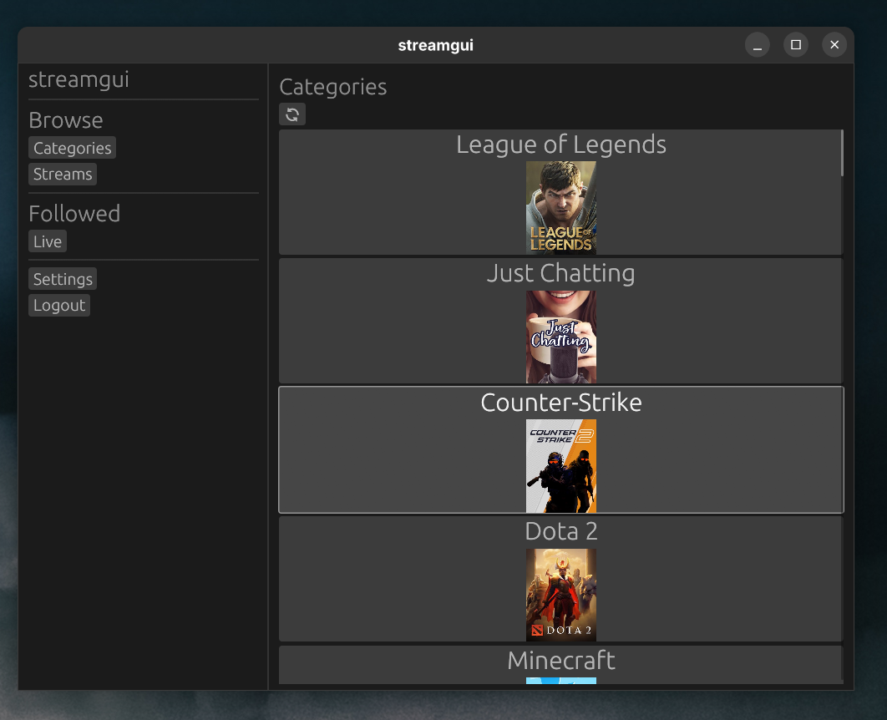

# streamgui

streamgui is a minimal stream interface and navigation tool for Twitch.

It's somewhat ugly at the moment and probably will crash on you. This was mainly an excuse to try egui out :)

### Acknowledgements

Inspired by [Streamlink Twitch GUI](https://streamlink.github.io/streamlink-twitch-gui/)

Invokes [Streamlink](https://streamlink.github.io/) to watch.

Thanks to https://github.com/twitch-rs/twitch_api for all the hard work.
